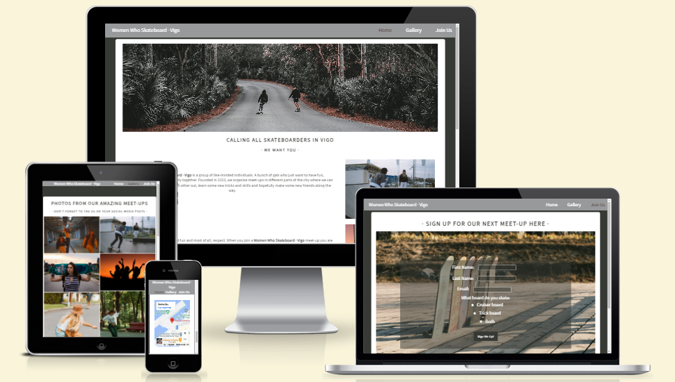
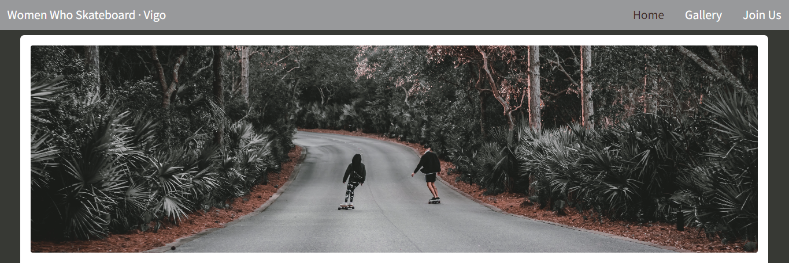
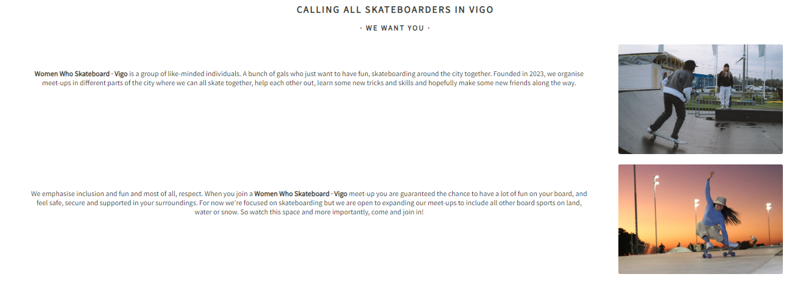
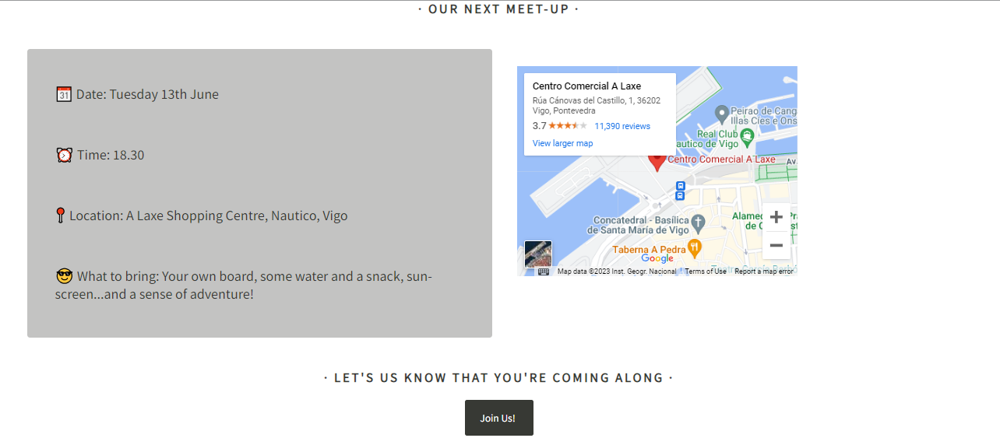
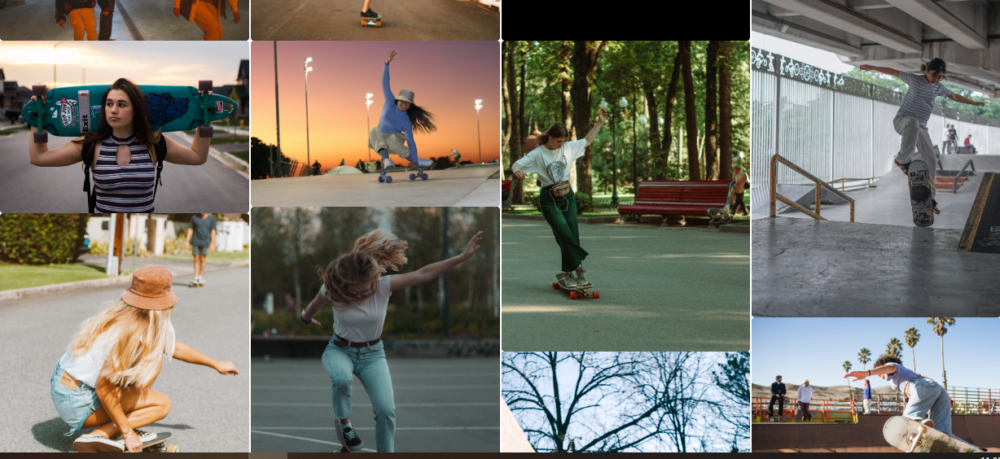
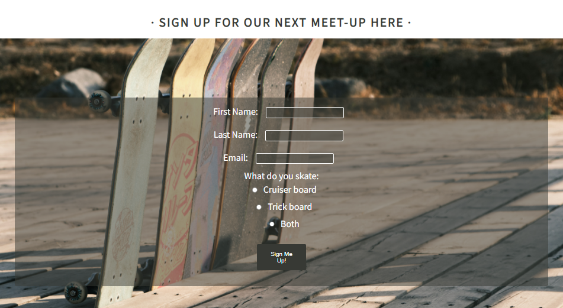
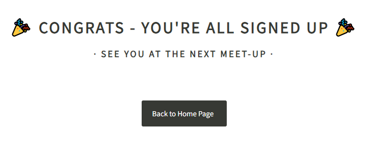
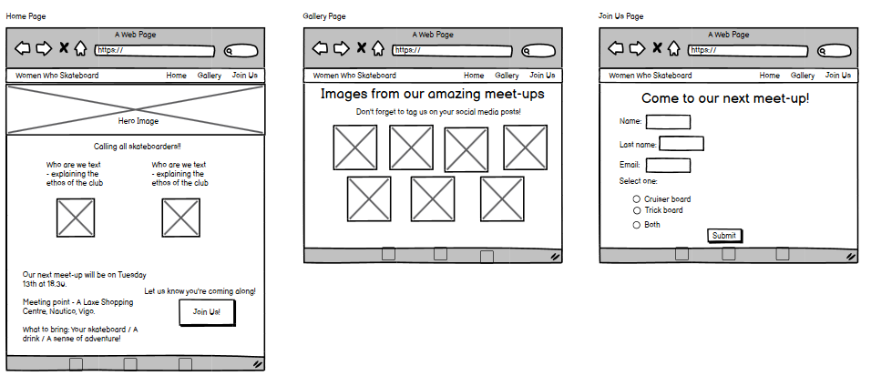
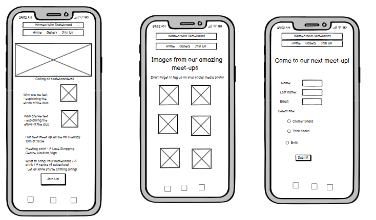

# Women Who Skateboard - Vigo

### The Purpose of the project

This project is intended to promote the group "Women Who Skateboard" and to reach the target audience of women based in Vigo, who want to meet up and skateboard together in a group.

Skateboarding is heavily dominated by male skaters, so with this site, the group "Women Who Skateboard" hope to create a warm and welcoming environment for women skaters in the city.

The site will share details of organised meet-ups for skaters in the city.

### User Stories

· Home Page - As a visiting user, I want to learn about the group and the next scheduled meet-up. I want to be able to sign up for the meet-up easily.

· Gallery Page - As a visiting user, I want to be able to see photos of myself, my friends and fellow skaters from any meet-ups I attend.

· Join Us Page - As a visiting user, I want to be able to submit my personal information quickly and easily to join the next meet-up.

· Confirmation Page - As a visiting user, I want to be sure that my name has been registered for the next meet-up and that the group will be expecting me.

### Features

· Nav Bar - the same design is used across all pages of the site. The logo on the left is a link to the Home page and on the right there are links to all the pages of the site. The page that is active is high-lighted in a different color.

· Hero Image - to grab the user's attention and link the color scheme of the site.

· About section - this section describes the group's intentions and target audience.

· Next Meet-Up section - the user can immediatlely see when and where the next meet-up will be.

· Embedded Map - An embedded Google Map of the meeting point has been included to make the site more visual for the user.

· Footer - This styling is uniform across all pages of the site with links to the group's social media sites and links to the site developers's GitHub and LinkedIn pages.

· Gallery of images - This allows new users to see what they can expect from the meet-ups and for returning users to see themselves at previous meet-ups.

· Sign-Up Form - This form allows the user to input their full name, email address and preferred board to skate with.

· Sign-Up Button - Directs the user to a confirmation page. This was the easiest solution to acknowledge the data input by the user without using Javascript.

· Confirmation page - the user is directed to this page to show their request to join the meet-up has been acknowledged.

### Future Features

· Sign-Up Form with Javascript - I'd like to develop the form and send the data to a database. And include if/or functions depending on which type of board the user selects.

· Meet-Up Suggestion Box - I'd like to include this feature so that users can suggest new meet-up locations or other activities and sports so that the group can expand and develop.

· Shop - As the group develops, I'd like to create a shop that sells the group's merch and skateboarding related products.

### Typography and Color Scheme

· The only type face used was Roboto. It is a geometric font with open, curvy shapes. It was manipulated to be bold or capitalized to differentiate the usages e.g. for a heading or a paragraph.

· The color scheme is derrived from the hero-image using the color picker tool. A dark gray is used as the text color, button color and body background. Light gray and white are used in the nav-bar and icon hover features. Rust-brown is used to hightlight the active page. The colors were selected to coordinate with the hero-image and to allow for sufficient contrast between the various text features on the pages with the background colors.

### Wireframes

Here are the wire frames designed for the three main pages - Home, Gallery and Join-Us. They show the page layout for large-screen devices and the responsive layout for small screen devices. They were designed using Balsamiq.

##### These are the wireframes for large-screen devices:

##### These are the wireframes for small-screen devices:

### Technology

· HTML

· CSS

### Testing

· Code Validation - W3C HTML https://validator.w3.org/nu/?doc=https%3A%2F%2Fbarty-s.github.io%2Fwomen-who-skateboard-vigo%2Findex.html

· CSS

· Test Cases:

#### Home page

As the user lands on the website homepage they will see the nav-bar with the logo in the top left, which is a link to the home page, and in the top right, the links to Home, Gallery and Join-Us pages. Scrolling down the user will see the hero image and immediately after this, information about the group is presented. After this section the user finds useful information about the time, date and location of the next meet-up where they can click a button that will navigate them to the Join-Us page.

#### Gallery page

The user will see the same nav-bar as on all pages of the site. Scrolling down they can see a gallery of images from previous meet-ups. Immediately after this there is a button linking to the Join-Us page, as on the Home page, so that user can easily navigate to the form where they can sign up for the next meet-up.

#### Join-Us page

This is the most interactive page:

- If the user clicks on the 'Sign me up!' button, a warning will appear, informing the user to input a valid first name.

- After inputting a valid first name, if the user clicks on the 'Sign me up!' button, a warning will appear, informing the user to input a valid last name.

- After inputting a valid last name, if the user clicks on the 'Sign me up!' button, a warning will appear, informing the user to input a valid email address.

- After inputting a valid email address, if the user clicks on the 'Sign me up!' button, a warning will appear, informing the user to choose one of the board type options from the radio list.

- After filling in all requried fields the user will be able to navigate to the confirmation page.

#### Confirmation Page

The user only arrives at the page after filling in the input form correctly. This page essentially confirms the receipt of the user's information. The user then sees a button to navigate back to the home page.

· Supported screens and browsers:
The site is fully responsive, presenting well on small screen devices with no horizontal overflow, as well as on large screen devices.

### Bug Fixes

- After running the site through the WC3 HTML validator I had to update the button and a-link code on each page to follow industry standards. I took a few tries to return no errors on the validator as I was trying to include an a-link inside a button element. I finally opted to style the link to look like a button.

- Another bug was the inclusion of a · in the nav-bar ul. I included the · for aesthetic reasons only but it presented as an error in the validator and so I chose to follow best practice of form following function and removed the ·.

- I had to change to original color I wanted for the active link, as the CSS validator indicated it didn't contrast enough to be considered readable. As well as that I had included a !important hack on the active link CSS but I removed it and included in-line styling to give the active link priority.

- To make the site automatically responsive I changed the horizontal styling from px to %.

### Deployment

· VS Code - Firstly, I used the CI template on GitHub as I was planning to use CodeAnywhere. But I had issues with the CodeAnywhere site so I chose to use VS Code as the editor for this site as I was already familiar with the programme. I created the file on my desktop then and then opened it in the VS Code programme. There I added the HTML files and assets folder.

· GitHub Desktop application - to make and then push commits to the GitHub repo.

· GitHub pages - I used this feature to deploy the site. Clicking on settings, then pages, and then deploy from branch. Everytime I pushed any changes, GitHub pages wasn't able to automatically update the repo so I had to manually update it by clicking on the 'Last deployed' link on the Pages page. And then clicking on 'Re-run all jobs' on the Actions page.

The live link can be found here -

· How to clone site: On GitHub click on the green <> Code button, in the dropdown menu select Local and copy the url for the repository. Create a file on your desktop and right click to open with code, ie VS Code, your local environment. On the welcome page select the option Clone Git Repo and paste the URL. Then save it to the folder you created on your desktop.

### Credits

· Media:

Images - https://pexels.com and https://unsplash.com

Icon images - Font Awesome library https://fontawesome.com/

· Content:

Font - Google Font library https://fonts.google.com/

Map embed - Google Maps https://www.google.com/maps

Flex-box code explanation - https://css-tricks.com/ and https://www.w3schools.com/

Code for Gallery display - from CI tutorials

Code to send user to Confirmation page - https://programminghead.com
